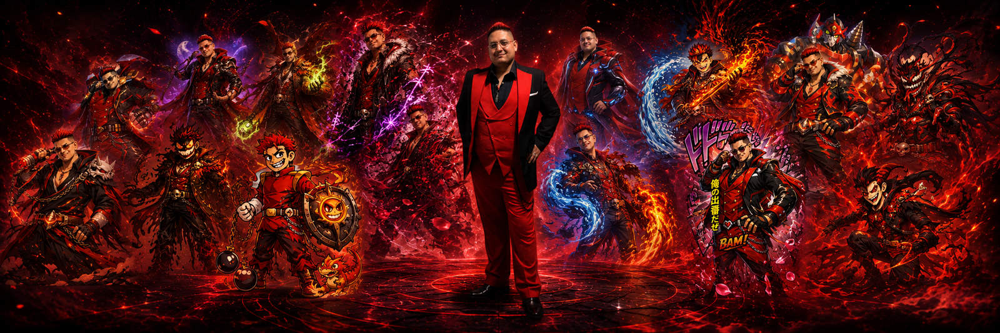

# dgtwzd1

> *I build because I've needed things that nobody freely offered.*

---

## What I do

I make tools that solve real problems for real people — clearly, affordably, and without feeding on confusion or desperation.

Not utilities as a hobby.  
Not side projects as a résumé line.  
Tools I actually needed and couldn't find done right.

---

## What I won't build

- fake urgency
- pricing you need a lawyer to understand
- subscriptions disguised as ownership
- products that detect pain and sell into it
- anything that gets easier to sell by making the user more confused

---

## Works

<!-- works:start -->
<!-- generated; do not edit by hand -->
| Project | What it does | Status |
|---|---|---|
| [systray-wrap-doubler](https://github.com/dgtwzd1/systray-wrap-doubler) | Windows 11 utility that gives system-tray icons a compact two-row layout. | `v0.1.0 — live` |
<!-- works:end -->

This list is generated from public GitHub repo evidence. Tools ship when they're solid, not when the calendar says so.

---

## The line I hold

> *We accept profit. We reject extraction.*

A product that solves a real problem doesn't need deception to sell itself.  
Users deserve plain language — what they're buying, what it does, what it costs, what it doesn't do, and what can make it stop working.

That's the whole standard. Everything I ship gets measured against it.

---

## Where I come from

I learned in an era when getting online still felt like opening a portal on purpose.  
I learned by wrestling with the thing until it made sense — not by copy-paste abundance.

My first two programs were Hello World and Snake.  
First I proved the machine could hear me.  
Then I proved it could move.

I build in that same sequence now. Prove it works. Then prove it moves.

---

## Tech

---

MIT where possible. Plain language always. No dark patterns — ever.
